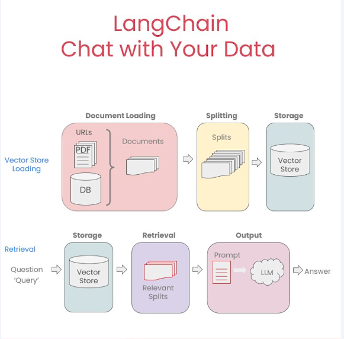

# 🎯 Smart Resume Screener

> An AI-powered resume screening system using RAG (Retrieval Augmented Generation) and LLMs to intelligently match candidates with job descriptions.
[Demo Video Link](https://www.loom.com/share/18f4744ce9df491f9ff4dd6f7a089278?sid=04eac1be-63a8-471a-bcb9-633b14f215d8)
---


### Our Solution
An intelligent resume screening system that:
1. **Automatically extracts** structured data from PDF resumes
2. **Semantically matches** candidates to job descriptions using AI
3. **Provides justifications** for match scores (explainable AI)
4. **Enables Q&A** about candidates using RAG-powered chat


---

## 🏗️ Solution Architecture

```
┌─────────────────────────────────────────────────────────────────┐
│                        USER INTERFACE                           │
│                   (React + TypeScript + Tailwind)               │
│  ┌──────────────┐  ┌──────────────┐  ┌──────────────┐           │
│  │Upload Resumes│  │  Match Jobs  │  │Chat w/Resume │           │
│  └──────────────┘  └──────────────┘  └──────────────┘           │
└─────────────────────────────────────────────────────────────────┘
                              ▼
┌─────────────────────────────────────────────────────────────────┐
│                      FASTAPI BACKEND                            │
│  ┌──────────────────────────────────────────────────────────┐   │
│  │                   API ENDPOINTS                          │   │
│  │  POST /upload-resume/    │  POST /match-job/             │   │
│  │  POST /chat-resume/      │  GET  /candidates/            │   │
│  └──────────────────────────────────────────────────────────┘   │
└─────────────────────────────────────────────────────────────────┘
                              ▼
┌─────────────────────────────────────────────────────────────────┐
│                     PROCESSING LAYER                            │
│  ┌────────────────┐  ┌────────────────┐  ┌─────────────────┐    │
│  │  PDF Parser    │  │  LLM Engine    │  │  RAG Pipeline   │    │
│  │  (PyPDF)       │  │  (Gemini 2.0)  │  │  (LangChain)    │    │
│  └────────────────┘  └────────────────┘  └─────────────────┘    │
└─────────────────────────────────────────────────────────────────┘
                              ▼
┌─────────────────────────────────────────────────────────────────┐
│                      STORAGE LAYER                              │
│  ┌────────────────┐  ┌────────────────┐  ┌─────────────────┐    │
│  │  Vector DB     │  │  File Storage  │  │  Embeddings     │    │
│  │  (ChromaDB)    │  │  (Local/S3)    │  │  (Gemini API)   │    │
│  └────────────────┘  └────────────────┘  └─────────────────┘    │
└─────────────────────────────────────────────────────────────────┘
```

### Component Breakdown

| Component | Technology | Purpose |
|-----------|------------|---------|
| **Frontend** | React 18, TypeScript, Tailwind CSS | Modern, responsive UI |
| **Backend** | FastAPI, Python 3.10+ | RESTful API server |
| **LLM** | Google Gemini 2.0 Flash | Text generation & analysis |
| **Embeddings** | Gemini text-embedding-004 | Semantic vector generation |
| **Vector DB** | ChromaDB | Similarity search |
| **Document Parser** | PyPDF | PDF text extraction |
| **RAG Framework** | LangChain | RAG orchestration |

---

## 🔄 RAG Pipeline Architecture

### What is RAG?
**Retrieval Augmented Generation** combines information retrieval with LLM generation to provide accurate, context-aware responses.

### Our RAG Implementation



*RAG Architechture*


### RAG Pipeline Code Flow

```python
# 1. Document Loading
loader = PyPDFLoader("resume.pdf")
documents = loader.load()

# 2. Text Splitting
text_splitter = RecursiveCharacterTextSplitter(
    chunk_size=1000,
    chunk_overlap=150
)
chunks = text_splitter.split_documents(documents)

# 3. Embedding & Storage
embeddings = GeminiEmbeddings(client)
vectorstore = Chroma.from_documents(
    documents=chunks,
    embedding=embeddings,
    collection_name="resumes"
)

# 4. Retrieval (on query)
retriever = vectorstore.as_retriever(
    search_kwargs={
        "k": 4,
        "filter": {"candidate_id": "candidate_123"}
    }
)

# 5. Question Answering
context = retriever.get_relevant_documents(question)
prompt = f"Context: {context}\n\nQuestion: {question}\n\nAnswer:"
response = gemini_client.models.generate_content(prompt)
```

---

## ✨ Features

### 🎯 Core Functionality

- **📤 Resume Upload**
  - PDF resume parsing
  - Automatic metadata extraction (name, email, skills, experience)
  - Duplicate detection

- **🔍 Intelligent Matching**
  - Semantic job-candidate matching (not just keywords)
  - Match score (0-10) with detailed justification
  - Skill gap analysis (matched vs missing skills)
  - Experience requirement validation

- **💬 Interactive Q&A**
  - Chat with individual resumes using RAG
  - Context-aware responses
  - Natural language queries

- **📊 Candidate Dashboard**
  - View all uploaded candidates
  - Sort by match score
  - Filter by skills/experience

---

## 🛠️ Tech Stack

### Backend
```python
FastAPI          # Web framework
Google Gemini    # LLM (text generation)
LangChain        # RAG framework
ChromaDB         # Vector database
PyPDF            # PDF parsing
Pydantic         # Data validation
```

### Frontend
```typescript
React 18         # UI framework
TypeScript       # Type safety
Tailwind CSS     # Styling
Lucide Icons     # Icon library
Vite             # Build tool
```


---

## 🤖 LLM Prompts & Prompt Engineering

### 1. Resume Data Extraction Prompt

```python
EXTRACTION_PROMPT = """
Extract candidate information from this resume as JSON.

Resume:
{resume_text}

Return this JSON (only JSON, no extra text):
{
  "name": "Full Name",
  "email": "email@example.com",
  "skills": ["Python", "Java", "React"],
  "experience_years": 3,
  "education": ["B.Tech Computer Science", "XYZ University"]
}

Rules:
- name: Get from top of resume
- email: Extract email address
- skills: All technical skills as array
- experience_years: Total years as number
- education: Degrees/schools as array
"""
```


### 2. Job-Candidate Matching Prompt

```python
MATCHING_PROMPT = """
Compare candidate with job and return JSON only.

Job: {job_title}
Description: {job_description}
Required Skills: {required_skills}
Required Experience: {experience_years} years

Candidate: {candidate_name}
Skills: {candidate_skills}
Experience: {candidate_experience} years

Return only this JSON (no markdown, no extra text):
{
  "match_score": 7.5,
  "justification": "Plain text summary in 2-3 sentences without asterisks",
  "matched_skills": ["Python", "FastAPI"],
  "missing_skills": ["Kubernetes"],
  "experience_match": true
}

Scoring Guide:
- 9-10: Perfect fit, exceeds requirements
- 7-8: Strong fit, meets most requirements
- 5-6: Moderate fit, some gaps
- 3-4: Weak fit, significant gaps
- 0-2: Poor fit, major misalignment

CRITICAL: Use plain text only, no markdown formatting.
"""
```


### 3. RAG Question-Answering Prompt

```python
QA_PROMPT = """
Use the following context from the candidate's resume to answer the question.

IMPORTANT: 
- Answer based ONLY on the provided context
- If information is not in context, say "This information is not available in the resume"
- Provide specific details (years, companies, technologies)
- Keep answers concise but informative
- Use plain text without markdown formatting

Context from resume:
{context}

Question: {question}

Answer (plain text only):
"""
```


---


## 📁 Project Structure

```
smart-resume-screener/
├── backend/
│   ├── main.py                 # FastAPI application
│   ├── requirements.txt        # Python dependencies
│   ├── .env                    # Environment variables
│   ├── .env.example           # Environment template
│   ├── uploads/               # Uploaded resumes (gitignored)
│   ├── chroma_db/             # Vector database (gitignored)
│   └── test_fixes.py          # Test suite
│
├── frontend/
│   ├── src/
│   │   ├── App.tsx            # Main React component
│   │   ├── main.tsx           # Entry point
│   │   └── index.css          # Tailwind CSS
│   ├── public/
│   ├── package.json
│   ├── tsconfig.json
│   ├── vite.config.ts
│   ├── tailwind.config.js
│   └── postcss.config.js
│
├── docs/
│   ├── ARCHITECTURE.md        # Detailed architecture
│   ├── RAG_PIPELINE.md        # RAG implementation details
│   ├── PROMPTS.md             # LLM prompt engineering guide
│   ├── TROUBLESHOOTING.md     # Common issues & solutions
│   └── API_GUIDE.md           # Complete API reference
│
├── .gitignore
├── LICENSE
└── README.md                  # This file
```

---

## 📸 Screenshots

### Upload Interface

*Upload Resume*

### Match Results

*AI-powered matching with scores, justifications, and skill analysis*

### Interactive Chat

*RAG-powered Q&A for deep-dive candidate exploration*

---


## 🙏 Acknowledgments

- **Google Gemini** for powerful LLM capabilities
- **LangChain** for RAG framework
- **ChromaDB** for vector storage
- **FastAPI** for elegant API design
- **React** community for UI components

---

## 📞 Contact & Support
- **Email**: kshitijdalvi22@gmail.com


---


**Made with ❤️ using Google Gemini and LangChain**

*Last updated: October 2025*
